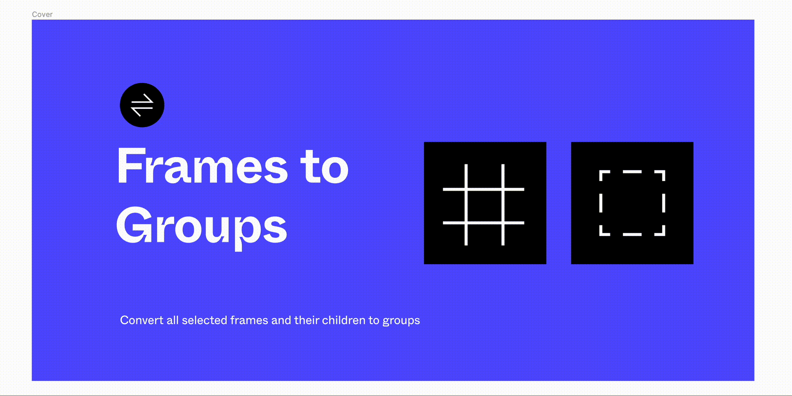

# Frames to Groups &mdash; Figma Plugin

> **⚠️ REPOSITORY STATUS: ARCHIVED**  
> This repository is now archived as the plugin has moved to a premium model with a forever free trial.
> New updates and features will be released in a private repository, but the plugin will remain available on the Figma Community with a generous free trial for all users.
>
> If you encounter any problems, please use the [/issues](https://github.com/maxmartynov/figma-plugin-frames-to-groups/issues) link to create a ticket.

This is a [Figma](figma.com) plugin that converts Frames to Groups, preserving their visual properties

## How To Use

Select layers and run the command `Convert Frames to Groups` and all
_Frames_ inside the selected layers will be converted to _Groups_.

## Features

- Works recursively inside nested Frames
- Preserves frame background colors and corner radii
- Compatible with Lottie animations export
- Includes Settings for fine-tuning behavior

## Cases

- If no layers are selected, then all frames on the page will be converted.
- If you select a _Frame_, only the inner _Frames_ will be converted,
  not the selected one.
- If a component with the type `Instance` is selected, nothing will be changed inside it. To convert _Frames_ inside an _Instance_ component
  you should select the source component of this _Instance_.

## Development

#### Installation

1. Install dependencies

   ```sh
   npm install
   ```

2. Get the [Figma desktop app](https://www.figma.com/downloads/). At this time, plugin development and testing needs to be done using the Figma desktop app. This is because Figma needs to read your code saved as a local file.

3. Log in to your account and open the file editor in the Figma desktop app.

4. Go to `Menu > Plugins > Development > New Plugin...`. This will bring up the "Create a plugin" modal. Choose the `manifest.json` from this project.

#### Watch

Run the watcher that will transpile .ts files into .js files on change

```sh
npm run dev
```

## Publishing

1. Bump the app version

   ```sh
   npm run release -- <version>

   # example:
   npm run release -- patch
   # or (shortcut)
   npm run patch
   ```

   _This command:_

   - increments the version in the `package.json`
   - creates and pushes commit and tag to the repo (see the `utils/release.sh` file to see the tag template)
   - makes the new build with the bumped version

2. Follow to the official guide [Publish plugins to the Figma Community](https://help.figma.com/hc/en-us/articles/360042293394-Publish-plugins-to-the-Figma-Community#Submit_your_plugin)

## Contributing

Pull requests are welcome. For major changes, please open an issue first to discuss what you would like to change.

## Credits

The idea initiator & artwork - [Filippos Protogeridis](https://github.com/protogeridis)

## Support

**Pricing Model**: This plugin now uses a premium model with a forever free trial! All basic functionality remains accessible to everyone.

## License

[MIT](LICENSE)
